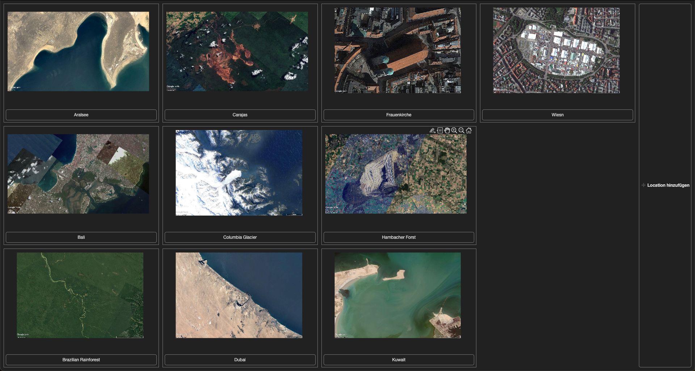
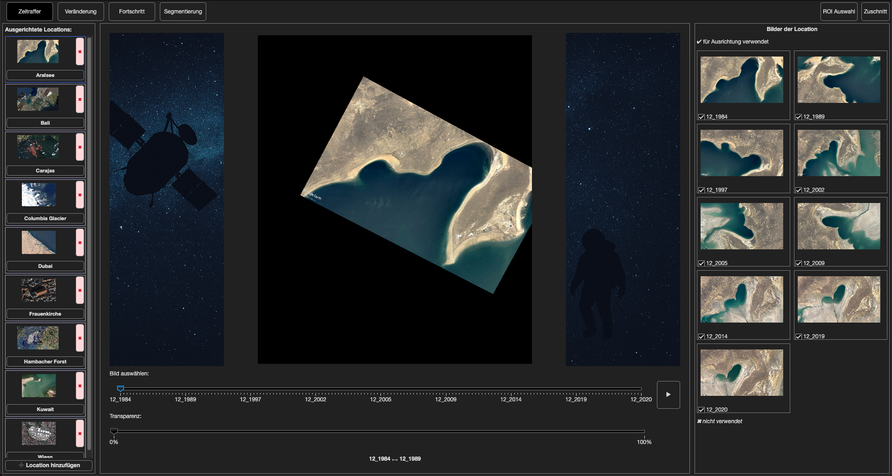
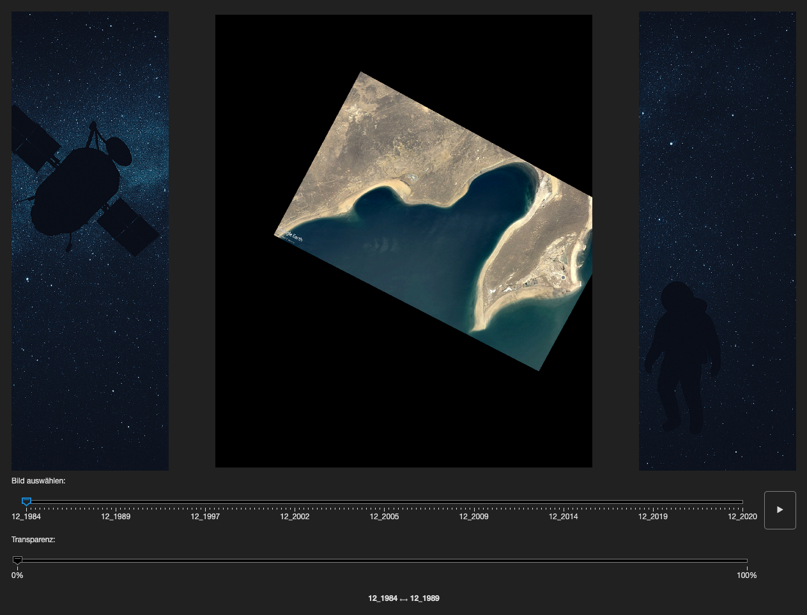
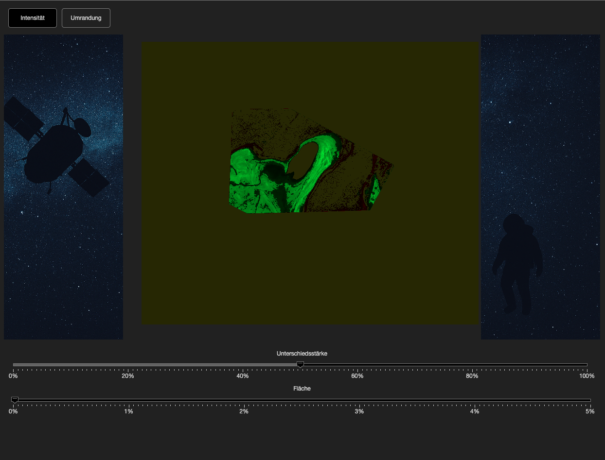
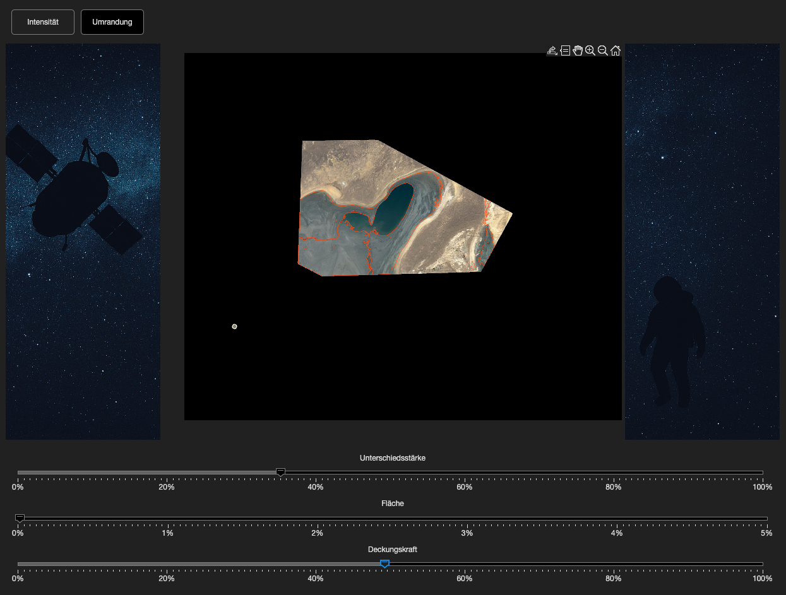
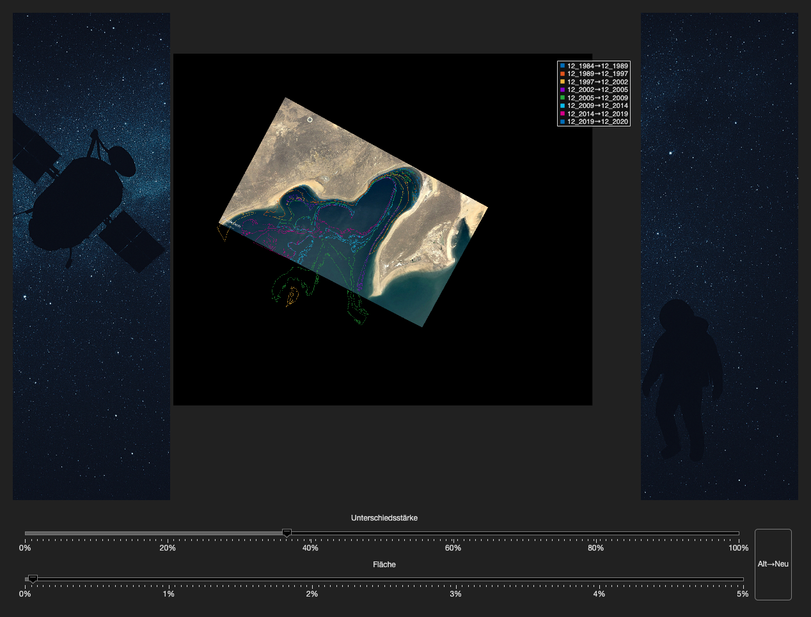
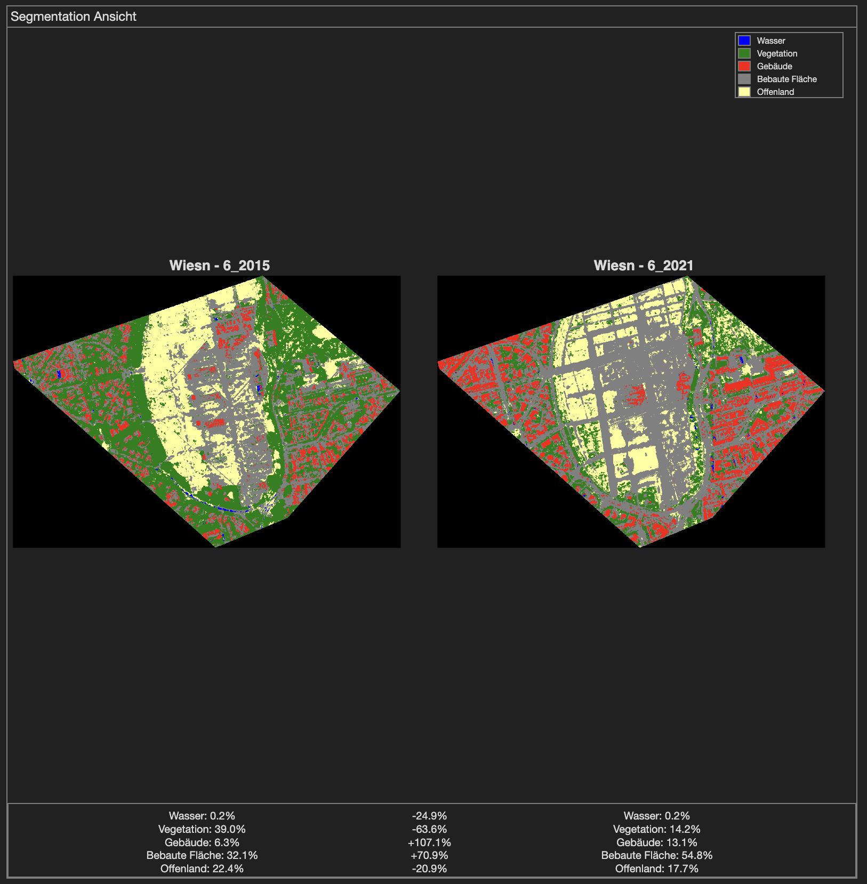

# Die Erde im Wandel: Veränderungen aus dem All

## Anforderungen

Für den Betrieb dieser Anwendung werden folgende MathWorks‑Toolboxen benötigt:

* **Deep Learning Toolbox**
* **Computer Vision Toolbox**
* **Signal Processing Toolbox**

> **Hinweis zur Performance:** Nach jedem Klick auf einen Button kann es – insbesondere auf leistungsschwächeren Rechnern – zu Verzögerungen kommen. Bitte warten Sie einen Moment, auch wenn sich die Oberfläche nicht sofort aktualisiert, da im Hintergrund umfangreiche Berechnungen stattfinden.

## 1. Auswahl der Location

  

Beim Start der App öffnet sich automatisch die **Location‑Auswahl**.
Hier finden Sie vordefinierte Satelliten‑Standorte und können über **„Location hinzufügen“** eigene Bilderserien importieren.
Die neu hinzugefügten Bilder werden automatisch ausgerichtet und in die linke Panel-Liste übernommen.

## 2. Hauptansicht

  

### Linkes Panel: Locations

* Liste aller ausgerichteten Locations mit Vorschaubildern.
* **➕ Location hinzufügen**: Import neuer Bilderserien.
* **✖ Alignment löschen**: Entfernt die Alignment-Daten und Metadaten.
* Klick auf einen Eintrag wechselt direkt zur gewählten Location.

### Rechtes Panel: Bildauswahl

* **✔ Ausgerichtete Bilder**: Bilder mit erfolgreichem Alignment.
* **✖ Nicht verwendete Bilder**: Bilder, die nicht ausgerichtet wurden.
* Checkboxen zum Ein- und Ausschließen einzelner Bilder.
* Scrollbare Ansicht zur Auswahl beliebig vieler Bilder (Ausnahme: Highlights und Segmentierung, hier maximal zwei).

### ROI und Zuschnitt

* **ROI Auswahl**: Wählen Sie einen Bereich (Region of Interest), um nur diesen Teil neu auszurichten.
* **Zuschnitt**: Zeigt nur den gemeinsamen Überlappungsbereich aller ausgewählten Bilder an und stellt danach die Ursprungsansicht wieder her.

## 3. Zeitraffer

  

* Standard-Ansicht nach dem Laden einer Location.
* **Play/Pause**-Button startet oder stoppt die automatische Wiedergabe (\~15 fps).
* **Erster Slider** (oben): Manuelle Auswahl des aktuellen Bildes in der Sequenz.
* **Zweiter Slider** (unten, nur im Pause-Modus): Regelt die Transparenz zwischen zwei aufeinanderfolgenden Bildern.
* **Datum-Anzeige** zeigt aktuellen Index und Datum des Bildes.

## 4. Veränderungs‑Highlights

  

  

Hier können Sie Unterschiede zwischen genau zwei Bildern visualisieren:

* **Intensitätsmodus**: Farbige Darstellung der Pixelveränderung.
* **Umrandungsmodus**: Konturen markieren die Übergänge.

Regler:

1. **Unterschiedsstärke** (Slider 1): Schwellenwert für Farb- oder Kontur-Erkennung.
2. **Fläche** (Slider 2): Minimale zusammenhängende Fläche relativ zur Bildgröße.
3. **Deckungskraft** (Slider 3, nur im Umrandungsmodus): Transparenz für das Overlay.

## 5. Fortschritts‑Ansicht

  

* Zeigt sequentiell alle Veränderungen als Kontur-Overlay in einer Achse.
* **Reverse**-Button (⇆): Tausch der Vergleichsrichtung (Alt→Neu / Neu→Alt) und Anpassung der Basis- und Overlay-Bilder.
* Regler und Legende entsprechen denen der Highlights-Ansicht.
* Darstellung der Paare von Bilddaten (z.B. `2020-01-01 → 2021-01-01`).

## 6. Segmentierung

  

* U-Net-Modell segmentiert urbane Landschaft in 5 Klassen:

  * Wasser, Vegetation, Gebäude, bebaute Fläche, Offenland
* Anzeige von zwei segmentierten Overlays nebeneinander.
* Prozentuale Anteile jeder Klasse für beide Zeitpunkte.
* Differenz-Anzeige der prozentualen Veränderung.
* Dynamische Legende mit Farbcodes oben links.

---

Weitere Informationen und Details zur Bedienung finden Sie in der Dokumentation der einzelnen Views und Funktionen.
